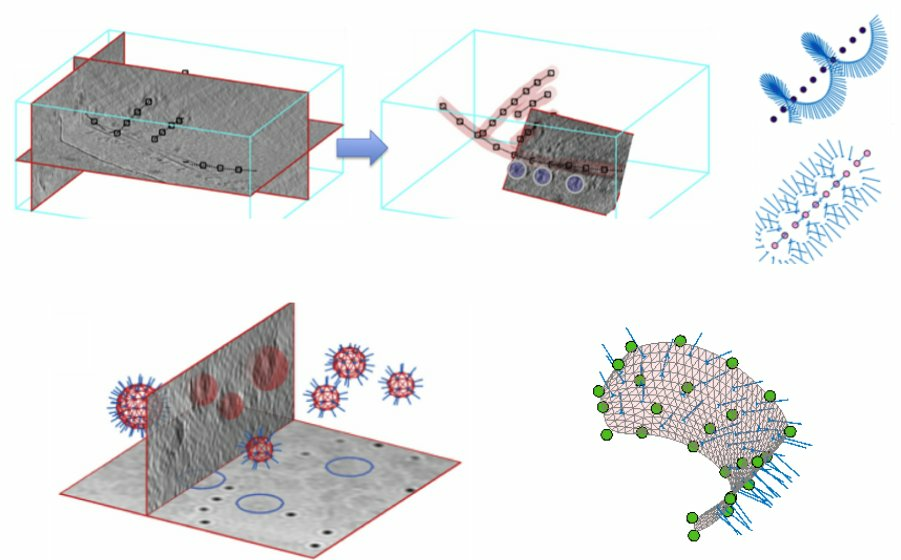

# dynamo2m
[](https://pypi.python.org/pypi/dynamo2m/)
[](https://pypi.python.org/pypi/dynamo2m/)
[](https://zenodo.org/badge/latestdoi/273026988)

`dynamo2m` is a small set of tools providing a bidirectional interface between the subtomogram averaging software 
[Dynamo](https://wiki.dynamo.biozentrum.unibas.ch/w/index.php/Main_Page) 
and the 
[Warp-RELION-M](http://www.warpem.com/warp/?page_id=1614) pipeline.

A description of the workflow for working between Warp, Dynamo and M can be found [here](https://wiki.dynamo.biozentrum.unibas.ch/w/index.php/Integration_with_Warp_and_M)


## Motivation
Dynamo is a tomography specific software package with many useful tools for subtomogram averaging including...

- Flexible [subtomogram averaging](https://wiki.dynamo.biozentrum.unibas.ch/w/index.php/Dcp_GUI) workflows
- [Geometric modelling and visualisation tools](https://wiki.dynamo.biozentrum.unibas.ch/w/index.php/Model) for particle picking and tomogram annotation
- [Automated tilt-series alignment](https://wiki.dynamo.biozentrum.unibas.ch/w/index.php/Walkthrough_on_command_line_based_tilt_series_alignment)
- [Multireference based classification](https://wiki.dynamo.biozentrum.unibas.ch/w/index.php/Multireference_Analysis)
- [PCA based classification and analysis tools](https://wiki.dynamo.biozentrum.unibas.ch/w/index.php/Walkthrough_on_PCA_through_the_command_line)
- Interactive tools for [initial model generation](https://wiki.dynamo.biozentrum.unibas.ch/w/index.php/Starters_guide#Initial_model_generation)
- Ways to [visualise](https://wiki.dynamo.biozentrum.unibas.ch/w/index.php/Walkthrough_for_lattices_on_vesicles#Merging_the_tables) subtomogram averaging results

M is a software package which allows one to perform multi-particle refinements with the aim of correcting for various 
sample deformations which can occur during imaging, it currently holds the record for high resolution 
single particle analysis from frame-series and tilt-series data.

The ability to easily combine these software packages, particularly for particle picking using a modelled supporting geometry, is the goal of the scripts provided in this package.

 <p align="center">    
     
</p>

## Scripts
- `dynamo2warp` for the conversion of Dynamo metadata to facilitate extraction of particles in Warp
- `dynamo2relion` for the conversion of Dynamo tables to Relion 4 particle coordinates
- `warp2dynamo` for the conversion of Warp STAR files into Dynamo compatible metadata
- `relion_star_downgrade` to convert RELION 3.1 format STAR files into RELION 3.0 format STAR files for extraction in Warp


## Installation
Installation is available directly from the [Python package index](https://pypi.org/project/dynamo2m/)
```
pip install dynamo2m
```


## Usage
Each of the scripts can be invoked directly from the command line and each has an interactive command line interface. 

For example
```
dynamo2warp
```

```
Input Dynamo table file: example.tbl
Input Dynamo table map file: example.doc
Output STAR file: test.star
Done! Converted 'example.tbl' to RELION/Warp/M compatible STAR file 'test_data.star'

```

Alternatively, options can be passed directly at the command line, this is detailed in the help provided with each script

```
dynamo2warp --help
```

```
Usage: dynamo2warp [OPTIONS]

Options:
  -i, --input_table_file PATH  [required]
  -tm, --table_map_file PATH   [required]
  -o, --output_star_file PATH  [required]
  --help                       Show this message and exit.

```
